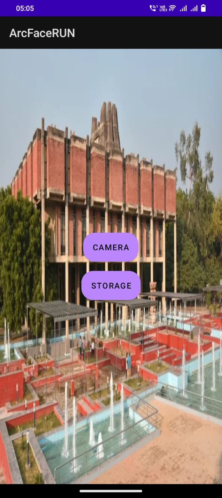
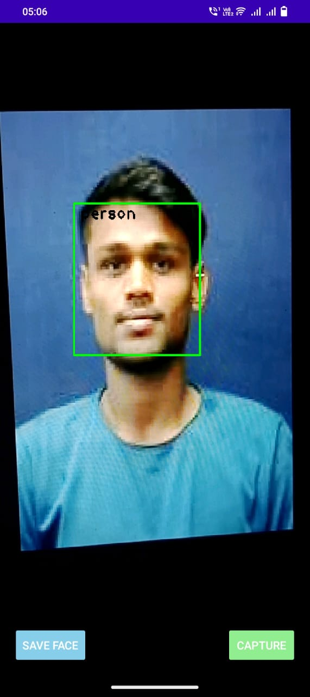

# Smart-Attendance-System-with-Edge-Computing
Prof. Nisheeth shrivastava

 Developed Face Recognition app utilising pre-trained models, employing Edge‑Computing for efficiency, and enabling real‑time
 sync through WiFi‑Direct.
 • Fine‑tuned models, including FaceNet and ArcFace, utilised face embeddings with a custom loss function, ensured secure data
 transfer and redundancy using checksum.
 • Delivered accurate recognition, instant data synchronisation, reliable data integrity, and an intuitive user interface for seamless
 attendance management.
 implemented a highly scalable database management system for accurate nationwide attendance tracking.

 

